# 🚀 VProfile DevOps Project

🚀 A hands-on multi-tier application deployment on AWS demonstrating real-world DevOps practices, including infrastructure setup, service integration, and production-like troubleshooting.

---

## 📌 Overview

This project showcases a **manual deployment of a multi-tier web application** on AWS, focusing on infrastructure, networking, and system integration rather than application development.

The system is composed of:

- Application Layer (Apache Tomcat)
- Database Layer (MySQL / MariaDB)
- Messaging Layer (RabbitMQ)
- Caching Layer (Memcached)
- Load Balancing (AWS Application Load Balancer)
- Internal Service Discovery (Route 53 Private DNS)

---

## 🧱 Architecture

Users → Load Balancer → Tomcat (App) → Backend Services  
                                      ↳ MySQL  
                                      ↳ Memcached  
                                      ↳ RabbitMQ  

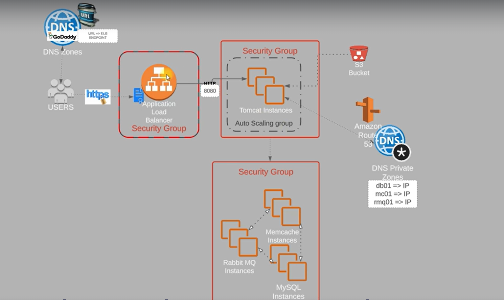

---

## 🛠️ Technologies Used

- AWS EC2
- AWS S3
- AWS Route 53 (Private Hosted Zone)
- AWS Application Load Balancer (ALB)
- Linux (Ubuntu / Amazon Linux)
- Apache Tomcat
- Maven
- MySQL (MariaDB)
- Memcached
- RabbitMQ

---

## 📦 Application Source Code

The application used in this project is not developed by me.  
It is used for demonstrating deployment and infrastructure practices:

👉 https://github.com/hkhcoder/vprofile-project

---

## ⚙️ Step 1: Security Groups Configuration

Designed and configured Security Groups to enable **controlled communication between tiers**:

- ELB → App (HTTP/HTTPS → 8080)
- App → Database (3306)
- App → Memcached (11211)
- App → RabbitMQ (5672)

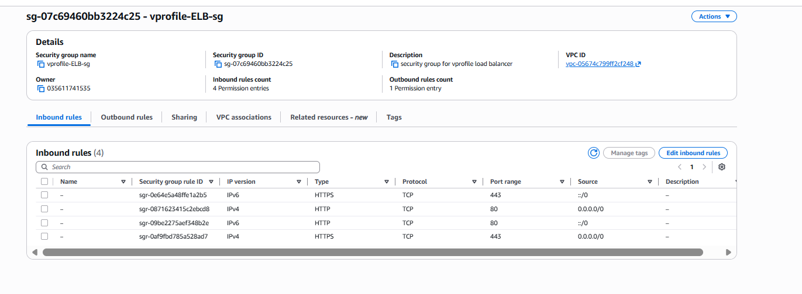  
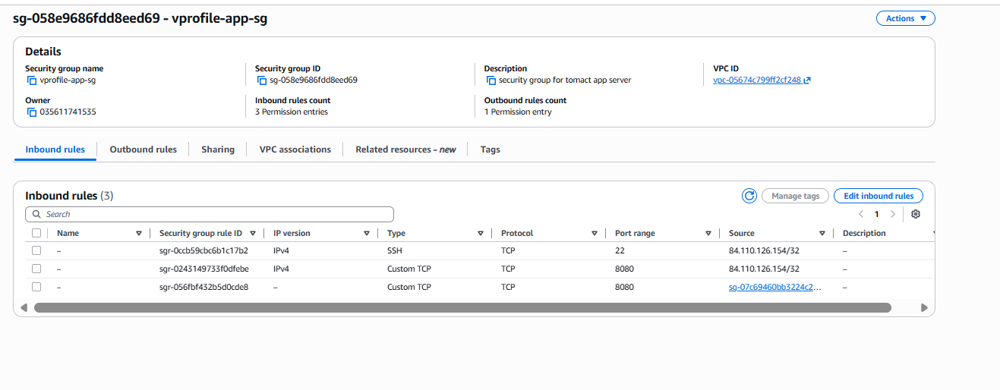  
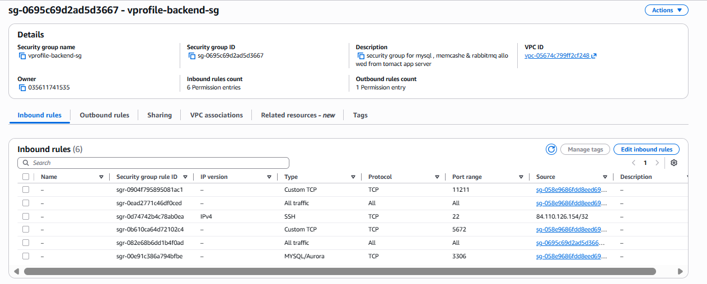

---

## ☁️ Step 2: EC2 Instances Setup

Provisioned 4 EC2 instances, each representing a layer in the architecture:

- `app01` → Application server (Tomcat - Ubuntu)
- `db01` → Database server (MySQL - Amazon Linux)
- `rmq01` → Messaging service (RabbitMQ)
- `mc01` → Caching service (Memcached)

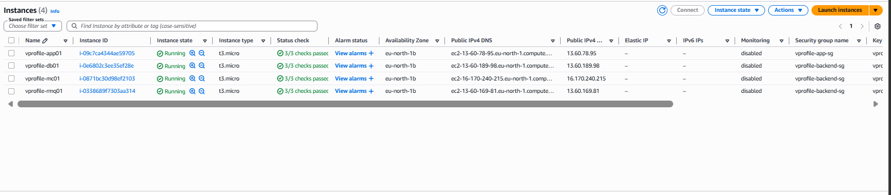

---

## 🧠 Step 3: Manual Provisioning with Bash Scripts

Configured all services manually using Bash scripts:

- Installed and configured MySQL with database and user setup
- Installed and configured RabbitMQ
- Installed and configured Memcached
- Installed Tomcat and deployed the application

⚠️ Note: This project emphasizes **manual setup before moving to Infrastructure as Code (IaC)**.

---

## 🌐 Step 4: Private DNS (Route 53)

Created a **Private Hosted Zone**:

```
vprofile.in
```

Configured internal service discovery:

```
db01.vprofile.in
rmq01.vprofile.in
mc01.vprofile.in
```

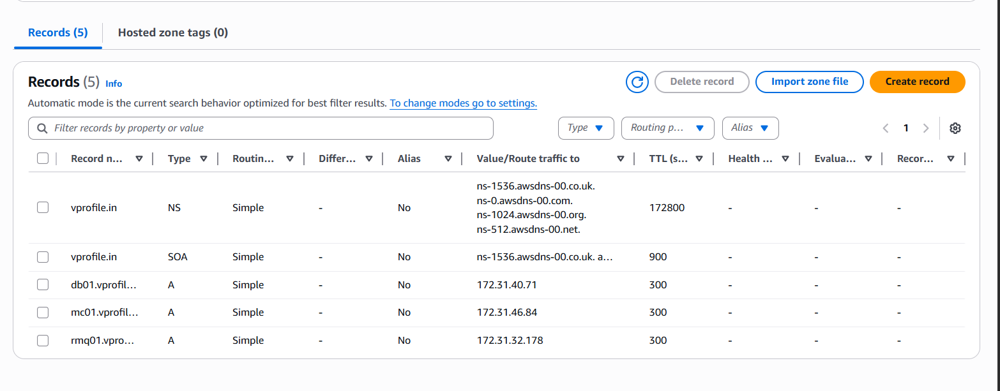

---

## ⚠️ Real Issue Faced (Critical Learning)

Initial misconfiguration:

```
db01.profile.in ❌
```

Resulted in:

```
DNS resolution failure
```

✔ Resolved by correcting DNS entries:

```
db01.vprofile.in ✅
```

---

## 📦 Step 5: Build Application (Maven)

Updated backend configuration in:

```
application.properties
```

Then built the application artifact:

```bash
mvn clean install
```

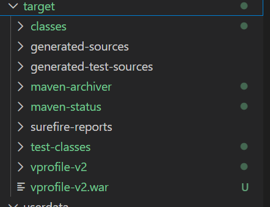

---

## ☁️ Step 6: Upload Artifact to S3

Uploaded the generated `.war` file to AWS S3 for deployment.

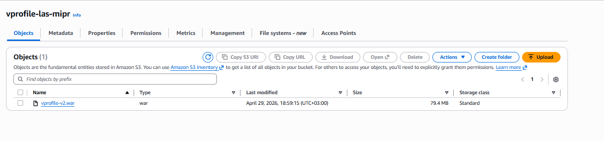

---

## 🚀 Step 7: Deploy on Tomcat

Deployed the application on the application server:

```bash
cp vprofile.war /var/lib/tomcat10/webapps/ROOT.war
systemctl restart tomcat10
```
---

## ⚖️ Step 8: Load Balancer Setup

Configured an Application Load Balancer:

- Created Target Group
- Attached `app01`
- Configured health checks
- Routed traffic from port 80 → 8080

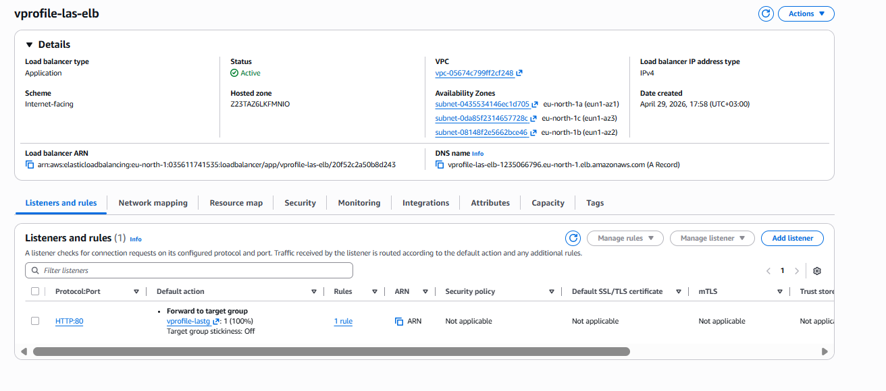  
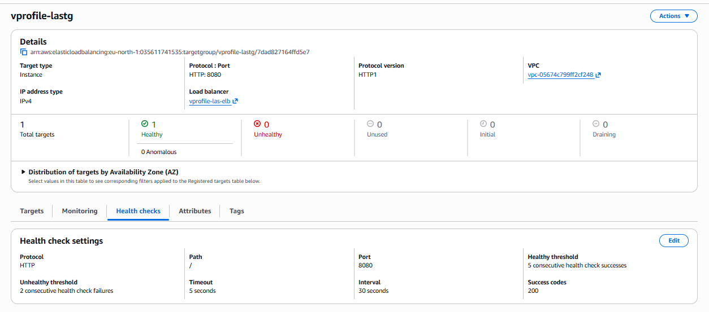

---

## 🔗 Step 9: Application Access

Application is accessible via:

```
http://<ELB-DNS>/login
```

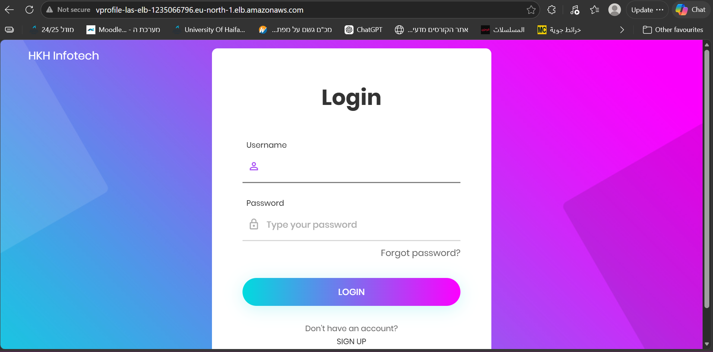

---

## 🔍 Step 10: Debugging & Troubleshooting

This project included real-world debugging scenarios:

- ❌ DNS resolution failures  
- ❌ Database connectivity issues  
- ❌ RabbitMQ connection errors  

✔ Resolved by:

- Fixing DNS configuration
- Restarting services
- Validating service communication between layers
---

## 🔥 Final Result

✔ Fully functional multi-tier application  
✔ All backend services integrated  
✔ Load-balanced application access  

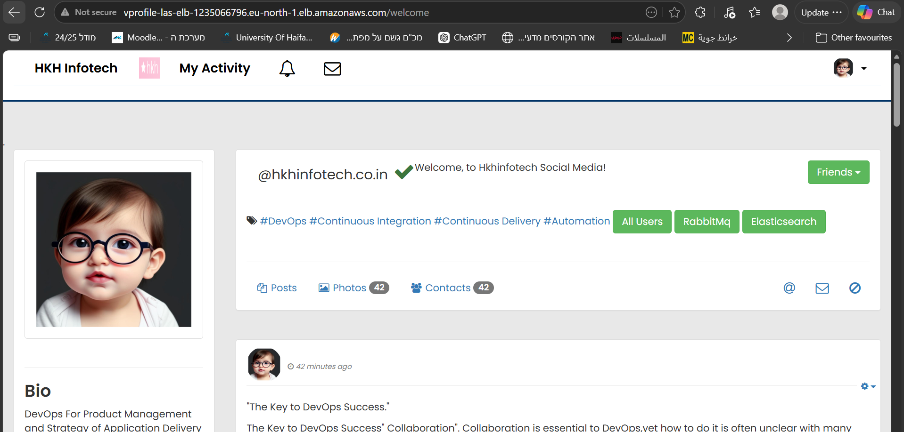
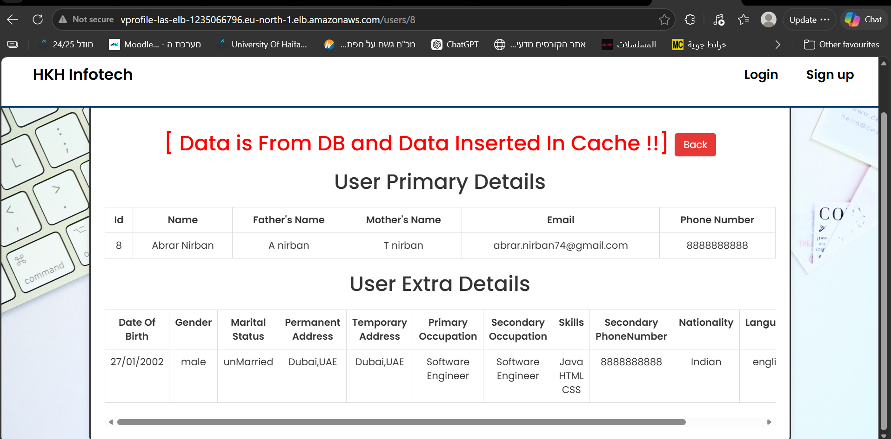
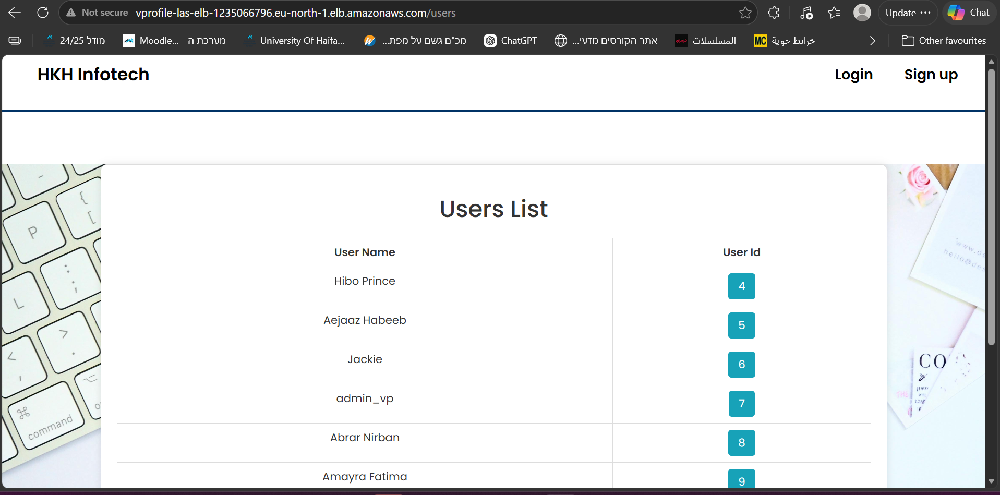
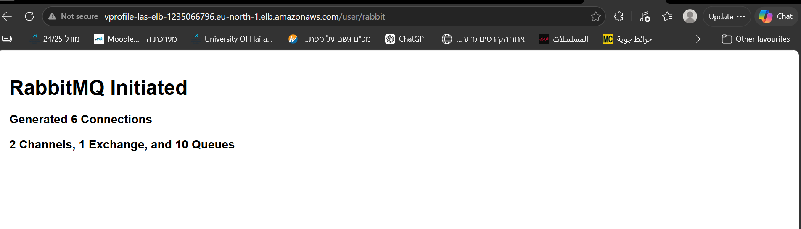
---

## 📚 Key Learnings

- Multi-tier architecture design
- AWS networking fundamentals
- Security Group design and traffic flow
- Private DNS with Route 53
- Service-to-service communication
- Real-world troubleshooting and debugging
- Manual deployment workflows

---

## 🚀 Future Improvements

- Infrastructure as Code (Terraform)
- CI/CD pipelines (GitHub Actions)
- Containerization (Docker)
- Orchestration (Kubernetes)
- Monitoring (Prometheus + Grafana)
